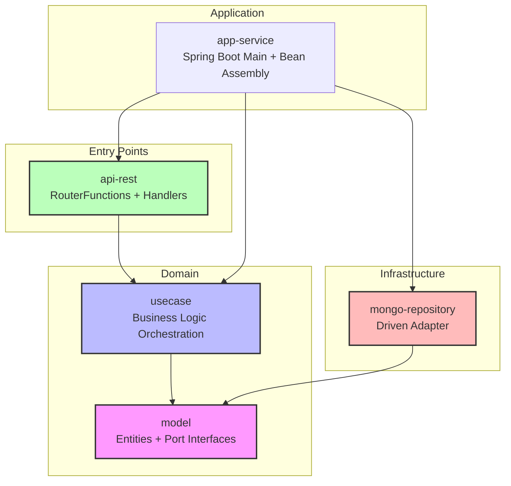
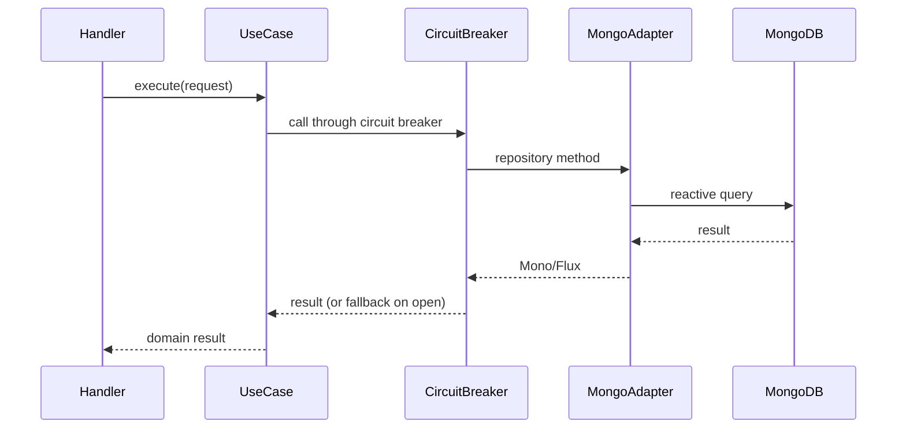
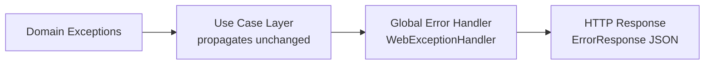

# Design Document: Franchise API

## Overview

The Franchise API is a reactive RESTful service built with Spring WebFlux that manages a franchise network comprising franchises, branches, and products. The system follows Clean Architecture principles using the Bancolombia scaffold (plugin `co.com.bancolombia.cleanArchitecture` v4.5.0), organized into domain, use cases, and infrastructure layers.

The API provides CRUD operations for franchises, branches, and products, along with a query endpoint to identify the highest-stocked product per branch within a franchise. All endpoints use reactive types (Mono/Flux), RouterFunctions for routing, and Handler classes for request processing. MongoDB is chosen as the persistence layer due to its natural fit for hierarchical data (franchise → branches → products) and its mature reactive driver support. Resilience4j provides circuit breaker protection for database calls.

**Key Design Decisions:**
- **MongoDB over relational DB**: The franchise/branch/product hierarchy maps naturally to documents. MongoDB's reactive driver (`spring-boot-starter-data-mongodb-reactive`) integrates seamlessly with Spring WebFlux.
- **Flat collection design**: Each entity (Franchise, Branch, Product) stored in its own collection with reference IDs rather than deeply nested documents. This avoids document size limitations and simplifies individual entity updates.
- **RouterFunction + Handler pattern**: Follows the scaffold's entry-point convention for reactive projects, avoiding annotation-based controllers entirely.
- **Domain-centric validation**: Validation logic lives in the domain layer (entity creation factories), keeping handlers thin and focused on HTTP concerns.

## Architecture

The project follows the Bancolombia scaffold multi-module Gradle structure:



**Dependency Rule**: All dependencies point inward. The domain layer has zero dependencies on infrastructure or frameworks. Use cases depend only on the model (port interfaces). Infrastructure modules implement the ports defined in the domain.

### Module Structure

```
franchise-api/
├── applications/
│   └── app-service/                    # Spring Boot main, config, bean wiring
├── domain/
│   ├── model/                          # Entities, value objects, port interfaces
│   └── usecase/                        # Application business logic
├── infrastructure/
│   ├── entry-points/
│   │   └── api-rest/                   # RouterFunctions, Handlers, DTOs
│   └── driven-adapters/
│       └── mongo-repository/           # MongoDB reactive implementation
├── Dockerfile
├── docker-compose.yml
├── terraform/
│   ├── main.tf
│   ├── variables.tf
│   └── outputs.tf
├── build.gradle
└── settings.gradle
```

## Components and Interfaces

### Domain Layer — Model Module

#### Port Interfaces (Repository Ports)

```java
// FranchiseRepository.java — Port interface
public interface FranchiseRepository {
    Mono<Franchise> save(Franchise franchise);
    Mono<Franchise> findById(String id);
    Mono<Franchise> update(Franchise franchise);
}

// BranchRepository.java — Port interface
public interface BranchRepository {
    Mono<Branch> save(Branch branch);
    Mono<Branch> findById(String id);
    Mono<Branch> update(Branch branch);
    Flux<Branch> findByFranchiseId(String franchiseId);
}

// ProductRepository.java — Port interface
public interface ProductRepository {
    Mono<Product> save(Product product);
    Mono<Product> findById(String id);
    Mono<Product> update(Product product);
    Mono<Void> deleteById(String id);
    Flux<Product> findByBranchId(String branchId);
}
```

### Domain Layer — Use Case Module

Each functional requirement maps to a use case class:

| Use Case | Responsibility | Requirements |
|----------|---------------|--------------|
| `CreateFranchiseUseCase` | Validate and create a franchise | Req 1 |
| `AddBranchUseCase` | Validate franchise exists, create branch | Req 2 |
| `AddProductUseCase` | Validate branch exists, create product | Req 3 |
| `RemoveProductUseCase` | Validate product/branch exist, delete product | Req 4 |
| `UpdateProductStockUseCase` | Validate product exists, update stock | Req 5 |
| `GetHighestStockProductUseCase` | Query highest stock product per branch | Req 6 |
| `UpdateFranchiseNameUseCase` | Validate franchise exists, update name | Req 7 |
| `UpdateBranchNameUseCase` | Validate branch exists, update name | Req 8 |
| `UpdateProductNameUseCase` | Validate product exists, update name | Req 9 |

### Infrastructure Layer — Entry Points (api-rest)

#### Router

```java
@Configuration
public class FranchiseRouter {
    @Bean
    public RouterFunction<ServerResponse> franchiseRoutes(FranchiseHandler handler) {
        return RouterFunctions.route()
            .POST("/api/franchises", handler::createFranchise)
            .PATCH("/api/franchises/{franchiseId}/name", handler::updateFranchiseName)
            .POST("/api/franchises/{franchiseId}/branches", handler::addBranch)
            .PATCH("/api/branches/{branchId}/name", handler::updateBranchName)
            .POST("/api/branches/{branchId}/products", handler::addProduct)
            .DELETE("/api/branches/{branchId}/products/{productId}", handler::removeProduct)
            .PATCH("/api/products/{productId}/stock", handler::updateProductStock)
            .PATCH("/api/products/{productId}/name", handler::updateProductName)
            .GET("/api/franchises/{franchiseId}/highest-stock", handler::getHighestStockProducts)
            .build();
    }
}
```

#### Handler

The `FranchiseHandler` class receives `ServerRequest`, extracts/validates DTOs, delegates to use cases, and maps results to `ServerResponse`. It handles:
- Request body deserialization
- Path variable extraction
- Input validation (non-empty names, non-negative stock)
- HTTP status code mapping (201 for creation, 200 for updates, 204 for deletion)
- Error response formatting

### Infrastructure Layer — Driven Adapters (mongo-repository)

Implements the port interfaces using Spring Data MongoDB Reactive:

| Adapter Class | Implements Port | Collection |
|---------------|----------------|------------|
| `MongoFranchiseRepository` | `FranchiseRepository` | `franchises` |
| `MongoBranchRepository` | `BranchRepository` | `branches` |
| `MongoProductRepository` | `ProductRepository` | `products` |

Each adapter uses a Spring Data `ReactiveMongoRepository` internally and maps between domain entities and MongoDB document classes.

### Circuit Breaker Integration

Resilience4j circuit breaker wraps all repository adapter calls:



**Configuration** (application.yml):
- `failureRateThreshold`: 50%
- `waitDurationInOpenState`: 30s
- `slidingWindowSize`: 10
- `permittedNumberOfCallsInHalfOpenState`: 3

When the circuit is open, calls immediately return a `ServiceUnavailableException` which the error handler maps to HTTP 503.

### API Endpoints

| Method | Path | Description | Status Codes |
|--------|------|-------------|--------------|
| POST | `/api/franchises` | Create franchise | 201, 400 |
| PATCH | `/api/franchises/{franchiseId}/name` | Update franchise name | 200, 400, 404 |
| POST | `/api/franchises/{franchiseId}/branches` | Add branch to franchise | 201, 400, 404 |
| PATCH | `/api/branches/{branchId}/name` | Update branch name | 200, 400, 404 |
| POST | `/api/branches/{branchId}/products` | Add product to branch | 201, 400, 404 |
| DELETE | `/api/branches/{branchId}/products/{productId}` | Remove product | 204, 404 |
| PATCH | `/api/products/{productId}/stock` | Update product stock | 200, 400, 404 |
| PATCH | `/api/products/{productId}/name` | Update product name | 200, 400, 404 |
| GET | `/api/franchises/{franchiseId}/highest-stock` | Highest stock per branch | 200, 404 |

## Data Models

### Domain Entities

```java
// Franchise.java
public class Franchise {
    private String id;
    private String name;
    
    // Factory method with validation
    public static Franchise create(String name) {
        if (name == null || name.isBlank()) {
            throw new InvalidInputException("Franchise name must not be empty");
        }
        Franchise franchise = new Franchise();
        franchise.name = name.trim();
        return franchise;
    }
    
    public void updateName(String newName) {
        if (newName == null || newName.isBlank()) {
            throw new InvalidInputException("Franchise name must not be empty");
        }
        this.name = newName.trim();
    }
}

// Branch.java
public class Branch {
    private String id;
    private String franchiseId;
    private String name;
    
    public static Branch create(String name, String franchiseId) {
        if (name == null || name.isBlank()) {
            throw new InvalidInputException("Branch name must not be empty");
        }
        Branch branch = new Branch();
        branch.name = name.trim();
        branch.franchiseId = franchiseId;
        return branch;
    }
    
    public void updateName(String newName) {
        if (newName == null || newName.isBlank()) {
            throw new InvalidInputException("Branch name must not be empty");
        }
        this.name = newName.trim();
    }
}

// Product.java
public class Product {
    private String id;
    private String branchId;
    private String name;
    private int stock;
    
    public static Product create(String name, int stock, String branchId) {
        if (name == null || name.isBlank()) {
            throw new InvalidInputException("Product name must not be empty");
        }
        if (stock < 0) {
            throw new InvalidInputException("Product stock must not be negative");
        }
        Product product = new Product();
        product.name = name.trim();
        product.stock = stock;
        product.branchId = branchId;
        return product;
    }
    
    public void updateStock(int newStock) {
        if (newStock < 0) {
            throw new InvalidInputException("Product stock must not be negative");
        }
        this.stock = newStock;
    }
    
    public void updateName(String newName) {
        if (newName == null || newName.isBlank()) {
            throw new InvalidInputException("Product name must not be empty");
        }
        this.name = newName.trim();
    }
}
```

### Domain Exceptions

```java
public class InvalidInputException extends RuntimeException { ... }   // Maps to 400
public class EntityNotFoundException extends RuntimeException { ... } // Maps to 404
public class ServiceUnavailableException extends RuntimeException { ... } // Maps to 503
```

### MongoDB Document Models (Driven Adapter)

```java
@Document(collection = "franchises")
public class FranchiseDocument {
    @Id
    private String id;
    private String name;
}

@Document(collection = "branches")
public class BranchDocument {
    @Id
    private String id;
    private String franchiseId;
    private String name;
}

@Document(collection = "products")
public class ProductDocument {
    @Id
    private String id;
    private String branchId;
    private String name;
    private int stock;
}
```

### Request/Response DTOs (Entry Point)

```java
// Request DTOs
public record CreateFranchiseRequest(String name) {}
public record CreateBranchRequest(String name) {}
public record CreateProductRequest(String name, int stock) {}
public record UpdateNameRequest(String name) {}
public record UpdateStockRequest(int stock) {}

// Response DTOs
public record FranchiseResponse(String id, String name) {}
public record BranchResponse(String id, String franchiseId, String name) {}
public record ProductResponse(String id, String branchId, String name, int stock) {}
public record HighestStockProductResponse(String branchId, String branchName, 
                                          String productId, String productName, int stock) {}
public record ErrorResponse(String code, String message) {}
```


## Correctness Properties

*A property is a characteristic or behavior that should hold true across all valid executions of a system — essentially, a formal statement about what the system should do. Properties serve as the bridge between human-readable specifications and machine-verifiable correctness guarantees.*

### Property 1: Blank name rejection

*For any* string composed entirely of whitespace (including the empty string), and for any entity type (franchise, branch, or product), attempting to create or update the entity's name with that string SHALL be rejected with a validation error, leaving the system state unchanged.

**Validates: Requirements 1.2, 2.3, 3.3, 7.3, 8.3, 9.3**

### Property 2: Valid name accepted on creation

*For any* non-blank string used as a name, creating a franchise, branch, or product with that name SHALL succeed and the returned entity SHALL contain the trimmed version of that name along with a non-null generated identifier.

**Validates: Requirements 1.1, 2.1, 3.1**

### Property 3: Name update preserves new value

*For any* existing entity (franchise, branch, or product) and *for any* non-blank string used as the new name, updating the entity's name SHALL succeed and the returned entity SHALL reflect the trimmed new name while preserving all other fields.

**Validates: Requirements 7.1, 8.1, 9.1**

### Property 4: Negative stock rejection

*For any* negative integer used as a stock value, creating a product with that stock or updating an existing product's stock to that value SHALL be rejected with a validation error, leaving the product's stock unchanged.

**Validates: Requirements 3.4, 5.2**

### Property 5: Valid stock update

*For any* non-negative integer and *for any* existing product, updating the product's stock to that value SHALL succeed and the returned product SHALL reflect exactly the new stock value.

**Validates: Requirements 5.1**

### Property 6: Product deletion round-trip

*For any* product that exists in a branch, after deletion the product SHALL no longer be retrievable by its identifier, and it SHALL no longer appear in the branch's product list.

**Validates: Requirements 4.1**

### Property 7: Highest stock query correctness

*For any* franchise with one or more branches each containing one or more products, the highest-stock query SHALL return exactly one product per branch, and for each returned product its stock SHALL be greater than or equal to the stock of every other product in that branch. Branches with no products SHALL be excluded from the result.

**Validates: Requirements 6.1, 6.3, 6.4**

### Property 8: Error response structure consistency

*For any* exception raised during request processing (validation errors, not-found errors, or unexpected errors), the API SHALL return a JSON response body containing exactly an error `code` field and a `message` field, and the response body SHALL NOT contain stack traces, class names, or internal technical details.

**Validates: Requirements 11.1, 11.2**

## Error Handling

### Strategy

Error handling follows a layered approach where domain exceptions propagate upward and are translated to HTTP responses at the entry-point layer:



### Exception-to-HTTP Mapping

| Domain Exception | HTTP Status | Error Code | Description |
|-----------------|-------------|------------|-------------|
| `InvalidInputException` | 400 Bad Request | `VALIDATION_ERROR` | Invalid input (blank name, negative stock) |
| `EntityNotFoundException` | 404 Not Found | `NOT_FOUND` | Referenced entity does not exist |
| `ServiceUnavailableException` | 503 Service Unavailable | `SERVICE_UNAVAILABLE` | Circuit breaker open / DB down |
| Any unhandled `Exception` | 500 Internal Server Error | `INTERNAL_ERROR` | Generic message, no technical details |

### Implementation

A `GlobalErrorHandler` implementing `WebExceptionHandler` (or using `@ControllerAdvice` equivalent for functional endpoints) intercepts all exceptions:

```java
@Component
@Order(-2)
public class GlobalErrorHandler implements WebExceptionHandler {
    @Override
    public Mono<Void> handle(ServerWebExchange exchange, Throwable ex) {
        ErrorResponse error = mapToErrorResponse(ex);
        int status = mapToHttpStatus(ex);
        // Write JSON response with appropriate status code
    }
}
```

### Validation Error Messages

Validation errors include the field name in the message to help API consumers identify the issue:
- `"Franchise name must not be empty"`
- `"Product stock must not be negative"`
- `"Branch name must not be empty"`

No internal state, class names, or stack traces are ever exposed in error responses.

## Testing Strategy

### Unit Tests (Example-Based)

Unit tests cover specific scenarios, error paths, and integration points:

- **Handler tests**: Verify HTTP status codes, request parsing, and response serialization
- **Use case tests**: Verify orchestration logic with mocked repositories
- **Not-found scenarios**: Verify 404 responses when entities don't exist (Requirements 2.2, 3.2, 4.2, 4.3, 5.3, 6.2, 7.2, 8.2, 9.2)
- **Router configuration**: Verify all routes are correctly mapped
- **Circuit breaker integration**: Verify fallback behavior when circuit is open

### Property-Based Tests

Property-based tests use [jqwik](https://jqwik.net/) (Java's mature PBT library for JUnit 5) to verify universal properties across generated inputs:

**Configuration:**
- Minimum 100 iterations per property test
- Each test tagged with: `Feature: franchise-api, Property {number}: {property_text}`

**Properties to implement:**

| Property | Generator Strategy |
|----------|-------------------|
| 1: Blank name rejection | Generate whitespace-only strings (spaces, tabs, newlines, empty) |
| 2: Valid name on creation | Generate arbitrary non-blank strings (including unicode, special chars) |
| 3: Name update preserves value | Generate arbitrary non-blank strings as new names |
| 4: Negative stock rejection | Generate negative integers (Integer.MIN_VALUE to -1) |
| 5: Valid stock update | Generate non-negative integers (0 to reasonable max) |
| 6: Product deletion round-trip | Generate random products, delete, verify absence |
| 7: Highest stock correctness | Generate random lists of products with varying stock values per branch |
| 8: Error response consistency | Generate random exception types and messages |

### Integration Tests

Integration tests use an embedded MongoDB (`de.flapdoodle.embed.mongo`) or Testcontainers:

- **Repository round-trips**: Save and retrieve entities, verify data integrity
- **Circuit breaker state transitions**: Simulate database failures, verify open/half-open/closed transitions
- **End-to-end API tests**: Full request/response cycle through `WebTestClient`
- **OpenAPI endpoint**: Verify spec is accessible and valid

### Test Organization

```
src/test/java/
├── domain/
│   ├── model/          # Entity creation/validation property tests
│   └── usecase/        # Use case logic tests (unit + property)
├── infrastructure/
│   ├── entrypoints/    # Handler/Router tests
│   └── adapters/       # Repository integration tests
└── integration/        # End-to-end tests
```
